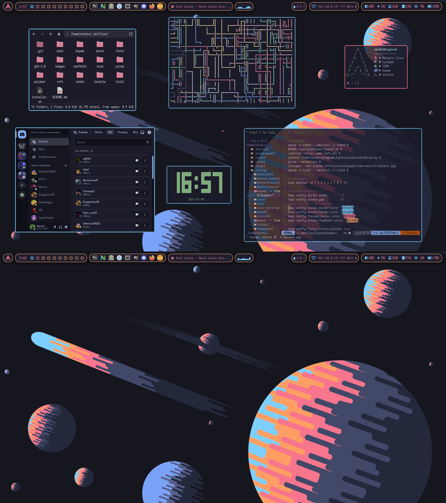

# Arch Linux BSPWM Ricing 

My linux configs for bspwm, sxhkd, tint2, polybar, picom, rofi and dunst.

### Info:
📥 = my configs/scripts

[📥](https://github.com/Narmis-E/linux-config/blob/main/bspwm/bspwmrc) - [bspwmrc](https://github.com/baskerville/bspwm/)\
[📥](https://github.com/Narmis-E/linux-config/blob/main/tint2/tint2rc) - [tint2](https://github.com/o9000/tint2)\
[📥](https://github.com/Narmis-E/linux-config/blob/main/sxhkd/sxhkdrc) - [sxhkd](https://github.com/baskerville/sxhkd)\
[📥](https://github.com/Narmis-E/linux-config/blob/main/polybar/config.ini) - [polybar](https://github.com/polybar/polybar)\
[📥](https://github.com/Narmis-E/linux-config/blob/main/scripts/playerctl.sh) - [playerctl](https://github.com/altdesktop/playerctl)\
[📥](https://github.com/Narmis-E/linux-config/blob/main/scripts/net-scroll.sh) - [zscroll](https://github.com/noctuid/zscroll)\
[📥](https://github.com/Narmis-E/linux-config/blob/main/picom/picom.conf) - [picom](https://github.com/pijulius/picom) (Pijulius fork)\
[📥](https://github.com/Narmis-E/linux-config/blob/main/termite/config) - [termite](https://github.com/thestinger/termite)\
[📥](https://github.com/Narmis-E/linux-config/blob/main/rofi/config.rasi) - [rofi](https://github.com/adi1090x/rofi)\
[📥](https://github.com/Narmis-E/linux-config/blob/main/dunst/dunstrc) - [dunst](https://github.com/dunst-project/dunst)\
[flameshot](https://github.com/flameshot-org/flameshot)\
[nitrogen](https://github.com/l3ib/nitrogen)

### Colour customisation tools:
[color-picker](https://github.com/Jack12816/colorpicker): pixel hex values to clipboard.\
[xev](https://github.com/freedesktop/xev): useful for finding the name of certain keystrokes\
[ImageGoNord](https://github.com/Schrodinger-Hat/ImageGoNord): nordifies any image (see some -nord versions in [wallpapers](https://github.com/Narmis-E/linux-config/tree/main/images/wallpapers))!

### This rice is now complete, and I am working on a [pywal version](https://github.com/Narmis-E/bspwm-pywal) because pywal is cool.
